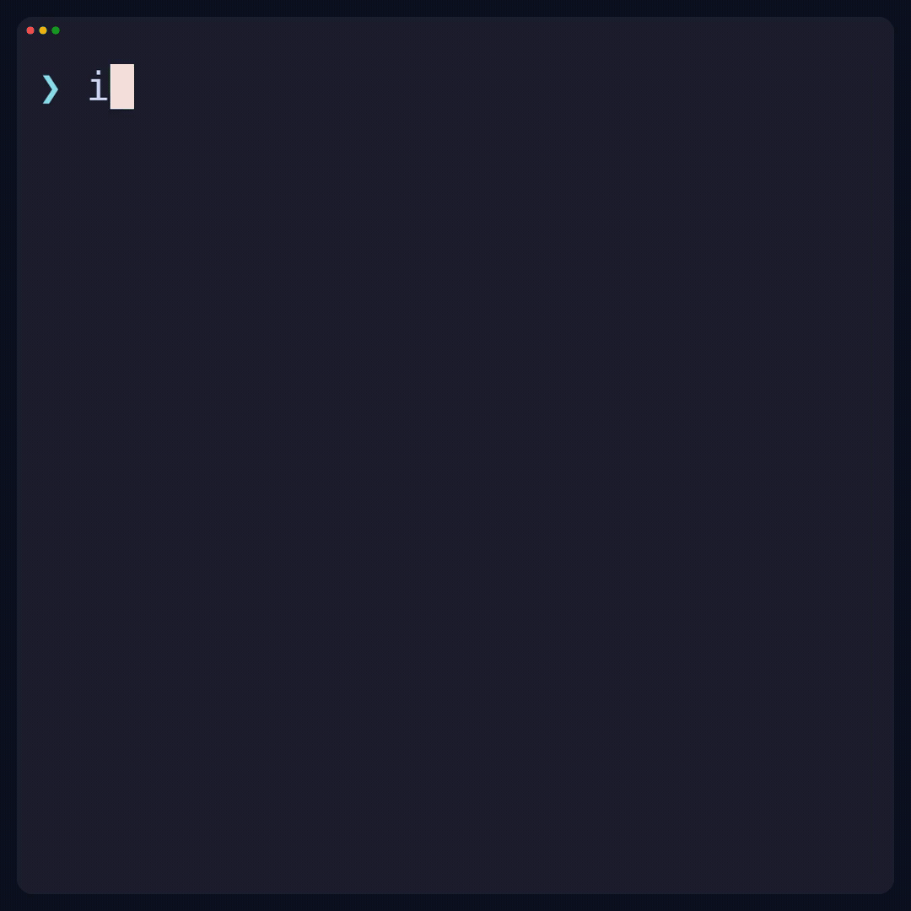

# iwant demos

Thirteen square terminal walkthroughs with larger text, colored prompts and results, and a rounded
terminal frame. Six clips cover CLI functionality; seven show interactive model launches.

## Functionality

| Flow | GIF | MP4 |
| --- | --- | --- |
| Pick and launch a model | [Watch](functionality/up.gif) | [Download](functionality/up.mp4) |
| Preview a launch without spending | [Watch](functionality/dry-run.gif) | [Download](functionality/dry-run.mp4) |
| Check cloud auth and see setup guidance | [Watch](functionality/auth.gif) | [Download](functionality/auth.mp4) |
| List models and endpoints | [Watch](functionality/list.gif) | [Download](functionality/list.mp4) |
| Select a cluster for SSH | [Watch](functionality/ssh.gif) | [Download](functionality/ssh.mp4) |
| Tear down a model and check the list | [Watch](functionality/down.gif) | [Download](functionality/down.mp4) |



## Model launches

Every clip runs `iwant up MODEL` and selects GCP, on-demand pricing, and 30-minute idle teardown.
GPU resources come from the model's latest repository recipe.

| Model | GIF | MP4 |
| --- | --- | --- |
| GPT OSS 20B | [Watch](models/gpt-oss-20b.gif) | [Download](models/gpt-oss-20b.mp4) |
| DeepSeek V4 Flash | [Watch](models/deepseek-v4-flash.gif) | [Download](models/deepseek-v4-flash.mp4) |
| DeepSeek V4.1 Flash | [Watch](models/deepseek-v4.1-flash.gif) | [Download](models/deepseek-v4.1-flash.mp4) |
| MiMo V2.6 Flash | [Watch](models/mimo-v2.6-flash.gif) | [Download](models/mimo-v2.6-flash.mp4) |
| Ling 3.0 Flash FP8 | [Watch](models/ling-3.0-flash-fp8.gif) | [Download](models/ling-3.0-flash-fp8.mp4) |
| Step 3.7 Flash | [Watch](models/step-3.7-flash.gif) | [Download](models/step-3.7-flash.mp4) |
| Step 3.7 Flash Optimized | [Watch](models/step-3.7-flash-optimized.gif) | [Download](models/step-3.7-flash-optimized.mp4) |

## Regenerate

Rebuild the devcontainer to install VHS 0.12.1, ttyd 1.7.7, FFmpeg, Chromium, and the recording font.
The pinned upstream binaries support Linux amd64 and arm64 and are verified against release checksums.
Then, from the repository root:

```bash
sudo uv pip install --system -e '.[dev]'
bash demo/render.sh                 # all 13 demos, GIF + MP4
bash demo/render.sh functionality   # six functionality clips
bash demo/render.sh models          # seven interactive model launches
```

The renderer uses system Python. It checks dependencies, creates a temporary
`iwant` wrapper in its own PATH, and runs the real Click CLI with the fixtures in `simulator.py`.
Fixture state persists between commands within a clip and resets between clips. The wrapper is removed
when rendering finishes. The installed `iwant` command is unaffected.

`common.tape` shares the 1080×1080 canvas, 44px font, rounded frame, theme, and timing. `session.tape`
sets up the colored shell prompt behind the scenes. Each clip has its own editable VHS tape and both
outputs are versioned alongside it. Recording-only styling accents the actual CLI output and displays
the wide listing table as compact cards. Launches finish on a dedicated endpoint screen with shortened
key previews. Prompt and completion waits have VHS's default 15-second
timeout; short pauses make selections readable. Recording commands alone set `VHS_NO_SANDBOX=true`
for container Chromium.

The recording backend uses local fixtures for cloud operations, health checks, and SSH, with shortened
wait times, example keys, and documentation addresses. The clips demonstrate the workflow rather than
measure startup speed. The simulator ignores `HF_TOKEN` from the host. Auth demonstrates setup guidance
without opening a browser. All media is generated locally, without cloud provisioning or publishing.

Validate the simulator and normal CLI behavior with:

```bash
python -m pytest
python -m ruff check .
python -m ruff format --check .
basedpyright --pythonpath "$(command -v python)"
```

The renderer also decodes each GIF and MP4 with FFmpeg to catch damaged or incomplete exports.
It renders clips sequentially and prevents concurrent renderer runs. GIFs are generated from the MP4s
using a two-pass palette, keeping memory use lower than simultaneous VHS GIF/video export.
